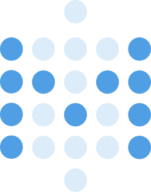
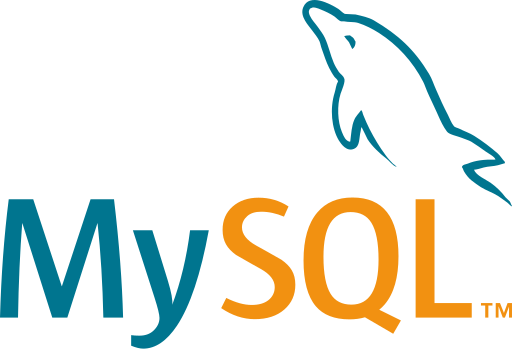
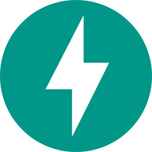
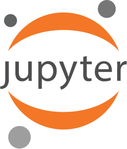
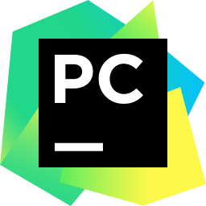

  <h1>
    Hi there, I'm Stiven
    
  </h1>

  
   

  
   

  

## 😎 About me:

  <h3>
    <samp>
      Data & BI Analyst who turns raw data into decisions.
      I work day-to-day with <b>Power BI, Excel, SQL and Python</b> — building interactive dashboards, automating reports and modeling data from multiple sources.
        
      My background in <b>financial and accounting analysis</b> helps me tie the numbers to real business impact.
    </samp>
  </h3>
   

---
## 🛠️ Tech Stack

&nbsp;&nbsp;
&nbsp;&nbsp;
&nbsp;&nbsp;
&nbsp;&nbsp;
&nbsp;&nbsp;
&nbsp;&nbsp;
&nbsp;&nbsp;
&nbsp;&nbsp;
&nbsp;&nbsp;
&nbsp;&nbsp;
&nbsp;&nbsp;
&nbsp;&nbsp;
&nbsp;&nbsp;
&nbsp;&nbsp;
&nbsp;&nbsp;
&nbsp;&nbsp;
&nbsp;&nbsp;
&nbsp;&nbsp;
&nbsp;&nbsp;
&nbsp;&nbsp;
&nbsp;&nbsp;
&nbsp;&nbsp;
&nbsp;&nbsp;
&nbsp;&nbsp;
&nbsp;&nbsp;
&nbsp;&nbsp;
&nbsp;&nbsp;
&nbsp;&nbsp;
&nbsp;&nbsp;
&nbsp;&nbsp;
&nbsp;&nbsp;

---
## 🎖️ Certificaciones

| Certificado | Empresa | Fecha | Credencial | Tecnologías |
|:---|:---|:---:|:---|:---|
| **Google Advanced Data Analytics** |  | Ago 2026 | [🔗 Ver Credencial](https://www.coursera.org/account/accomplishments/professional-cert/P7LQAK334NCM) |    |
| **The Nuts and Bolts of Machine Learning** |  | Ago 2026 | [🔗 Ver Credencial](https://www.coursera.org/account/accomplishments/certificate/0Q7V7G33T0RN) |    |
| **Certificación de Google Analytics** |  | May 2026 | [🔗 Ver Credencial](https://skillshop.credential.net/fdb7e885-58ca-4f1b-89c5-19ea294e2205#acc.hJftLXrY) |   |
| **Academy Accreditation - Generative AI Fundamentals** |  | Oct 2025 | [🔗 Ver Credencial](https://credentials.databricks.com/dde82920-474d-4296-b82a-9fd8a12c57c9#acc.E0Z5SXOR) |    |
| **Extracción de Datos de la Web** |  | Jun 2025 | [🔗 Ver Credencial](https://www.udemy.com/certificate/UC-66f2f48a-249c-4347-a5b2-6ce32eee4130/) |    |
| **DataOps Fundamentals** |  | Jun 2025 | [🔗 Ver Credencial](https://learn.datakitchen.io/certificate/ODIwMDBfMjE5MDYxMQ) |    |
| **SQL Avanzado** |  | Abr 2025 | [🔗 Ver Credencial](https://drive.google.com/file/d/1zaZ7cChzhPeeSWz2ZoWwX_0KRWJfocuj/view?pli=1) |    |

---

## 📖 En Formación

| Programa | Institución | Estado | Inicio |
|:---|:---|:---:|:---|
| **MBA - Business Intelligence y Big Data** |  | 🔄 En progreso | 2025 |
| **Diplomado en IA Generativa** |  | 🔄 En progreso | 2025 |

---

## 📊 GitHub Stats

<!-- 1. Tarjeta generada localmente por GitHub Actions -->

## 🔗 Connect with me

  
  
  

